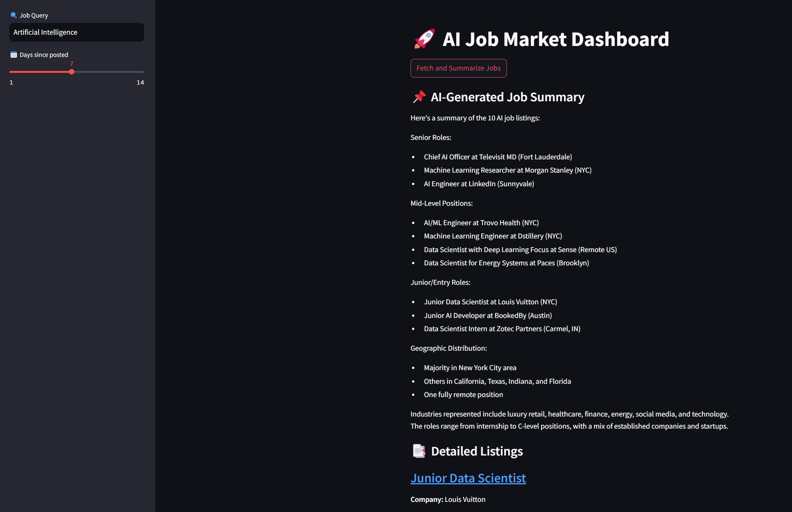

# 🚀 AI Job Market Dashboard

An interactive AI-powered dashboard built with **Python, LangChain, Anthropic Claude AI, and Streamlit** to scrape and summarize recent AI job postings from LinkedIn.

## 📌 Key Features:
- Scrapes recent AI job postings directly from LinkedIn.
- Generates clear, concise summaries using Claude via LangChain.
- Interactive and user-friendly UI built with Streamlit.

## 🛠️ Tech Stack:
- **LangChain**
- **Anthropic Claude 3**
- **Streamlit**
- **BeautifulSoup4**
- **Requests**

## 🗃️ Usage Instructions (clearly defined):

**1\. Clone this repository:**
```bash
git clone <repo_url_here>
cd ai-job-market-dashboard
